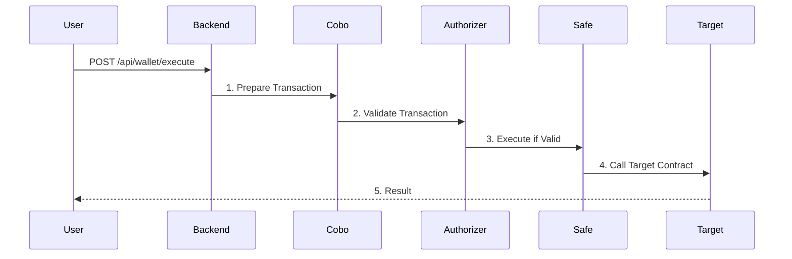

# Guru\_DeFAI

## Table of Contents

1. [Introduction](#introduction)
2. [Objective and Purpose](#objective-and-purpose)
3. [Contract Ownership and Access Rights](#contract-ownership-and-access-rights)
4. [Technical Implementation](#technical-implementation)
5. [Project Structure](#project-structure)
6. [Setup and Running Instructions](#setup-and-running-instructions)
7. [Frontend Setup](#frontend-setup)
8. [Technical Diagrams](#technical-diagrams)
9. [License](#license)
10. [N8N AI Prompt](#n8n-ai-prompt)

---

## Introduction

Guru\_DeFAI is a Proof-of-Concept (PoC) MVP designed to showcase the necessity of custody solutions for AI agents. It leverages open-source COBO ARGUS smart contracts and project-specific rules to ensure secure interaction with blockchain protocols. The project includes smart contracts, a user interface for demonstration, and a backend to facilitate initial configuration and deployment.

## Objective and Purpose

The primary goal of Guru\_DeFAI is to demonstrate how AI agents can securely manage blockchain assets using decentralized custody solutions. The project ensures that custody configurations are transparent and open-source, allowing controlled interactions with DeFi protocols. The backend component simplifies initial setup and rule enforcement, making it easier to integrate AI with decentralized custody.

- **Smart Contracts**: Uses COBO ARGUS smart contracts for AI custody.
- **Authorization Rules**: Defines protocol interaction policies, including fund destinations and transaction limits.
- **Backend**: Manages initial setup and rule enforcement.
- **Frontend**: Provides a UI for demonstration and interaction.
- **AI Agent Architecture**:
  - **N8N Workflow Engine**: Orchestrates the process flow and handles:
    - User request validation
    - Transaction preparation
    - Protocol interaction rules
    - Response formatting
  - **OpenAI Integration**: Processes natural language inputs to:
    - Understand user intentions
    - Convert text commands to executable actions
    - Validate request parameters
    - Generate human-readable responses

## Contract Ownership and Access Rights

During the deployment process (`/api/wallet/create`), the following ownership structure is established:

1. **Safe Wallet**: 
   - Owner: User's frontend-connected address
   - Purpose: Main control point for all operations

2. **Cobo Argus Contracts**: 
   - Owner: Safe Wallet address
   - Purpose: Custody and transaction validation

3. **Authorizers**: 
   - Owner: Safe Wallet address
   - Admin rights: Granted to user's frontend-connected address
   - Purpose: Quick setup and modification of transaction rules

While contracts are deployed by the project's deployer address, all ownership and administrative rights are immediately transferred to the user's control during the setup process.

## Project Structure

### Backend

```
app/
├── api/                    # API endpoints
│   ├── wallet.py          # Wallet operations
│   ├── ai_request.py      # AI requests
│   └── info.py            # Informational endpoints
├── core/                   # Business logic
│   ├── protocols/         # DeFi protocols
│   └── wallet/            # Wallet components
├── db/                    # Database interactions
├── abi/                   # Smart contract ABIs
└── config/                # Configuration
```

### Frontend

```
client/
├── src/
│   ├── components/          # UI components
│   │   ├── CreateSafeDialog.tsx    # Safe creation dialog
│   │   └── AIChat.tsx             # AI chat component
│   ├── hooks/               # React hooks
│   │   ├── useWalletApi.ts        # Wallet API interaction
│   │   └── use-toast.ts           # Notifications
│   ├── context/             # React contexts
│   │   └── AuthorizersContext.tsx # Authorizers context
│   └── App.tsx             # Main component
```

## Setup and Running Instructions

### Backend Setup

1. Navigate to the backend directory and create a virtual environment:
   ```sh
   python3 -m venv venv
   source venv/bin/activate
   ```
2. Install dependencies:
   ```sh
   pip install -r requirements.txt
   ```
3. Start the backend server:
   ```sh
   python -m app.main
   ```

### Frontend Setup

1. Navigate to the frontend directory:
   ```sh
   cd frontend
   ```
2. Install dependencies:
   ```sh
   npm install
   ```
3. Start the frontend server:
   ```sh
   npm run dev
   ```

# Technical Diagrams

### Wallet Creation Flow


### Transaction Execution Flow


### Contract Deployment and Ownership Flow


## Environment Variables

### Backend (.env)

```
# Server settings
HOST=0.0.0.0
PORT=5010
DEBUG=True

# Blockchain settings
RPC_URL=https://rpc.soniclabs.com
CHAIN_ID=146

# Deployer settings
DEPLOYER_ADDRESS=your_deployer_address
DEPLOYER_PRIVATE_KEY=your_deployer_private_key

# Agent settings (for generating agent wallets)
AGENT_MNEMONIC=your_mnemonic_phrase
AGENT_DERIVATION_PATH=m/44'/60'/0'/0/

# AI Service settings
AI_SERVICE_URL=your_ai_service_url
AI_SERVICE_KEY=your_ai_service_key

# Contract addresses
SAFE_FACTORY_ADDRESS=0x4e1DCf7AD4e460CfD30791CCC4F9c8a4f820ec67
SAFE_SINGLETON_ADDRESS=0x29fcB43b46531BcA003ddC8FCB67FFE91900C762
COBO_FACTORY_ADDRESS=0x14149ab9476c12ab55ef6831cbE973B77De7f2Ac
FALLBACK_HANDLER_ADDRESS=0x0000000000000000000000000000000000000000

# Authorizer implementations
APPROVE_AUTHORIZER_IMPL=0x65949fD26c04DbA182F1B8C277A4BfA4fC77dACa
SILO_AUTHORIZER_IMPL=0x425ab37703a7eE412e8187505055c82870D60B65
```

### Frontend (/frontend/.env.local)

```
# .env.local for development
VITE_API_URL=http://localhost:5010
VITE_FRONTEND_URL=http://localhost:5011
VITE_RPC_URL=https://rpc.soniclabs.com
PORT=5011
NODE_ENV=development
```

## License


- **Cobo Argus** ([https://www.cobo.com/products/argus](https://www.cobo.com/products/argus)) under the LGPL-3.0 license.
- **Safe Wallet** ([https://safe.global/](https://safe.global/)) under the LGPL-3.0 license.

## N8N AI Prompt

```
You are a highly specialized assistant for blockchain operations and smart contract interactions. You will receive an input JSON with the following structure:

{
    "user_address": "<user address value>",
    "request": "<a textual instruction, e.g., 'make approve wS to SiloRouter in amount 1 in ether'>"
}

When you need to find the highest yield or APR, ask get Silo APR tool. The result is the contract address of the highest APR. Use it following the answer format:

Produce an output JSON, using GET_methods tool, in the exact format below (and nothing else):

{
    "user_address": "<value from the input>",
    "action": "<determined method name>",
    "params": {
        "token_address": "<value>",
        "amount": "<value>"
    }
}

If you receive a 404 response from the GET_methods tool, your answer should be "cant get available methods".
```

